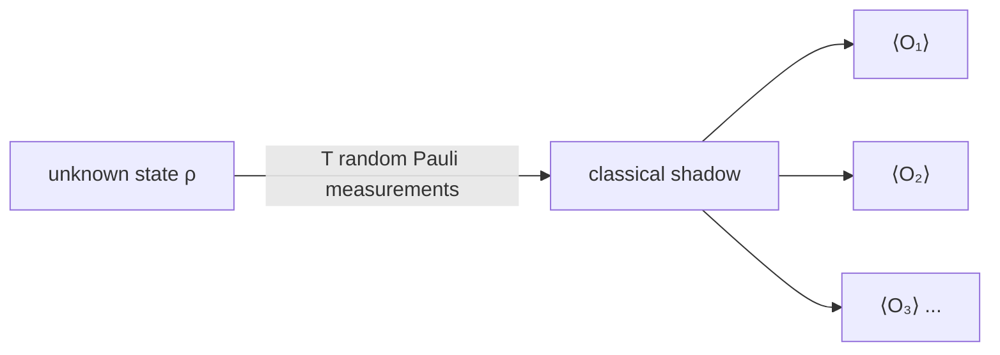

<div align="center">

# Hi, I'm Ishita.

### Studying how machines learn, reason, and get things confidently wrong.

Computer Engineering · Thapar Institute of Engineering & Technology · Class of 2027

[](https://scholar.google.com/citations?user=3gXj9skAAAAJ&hl=en)
[](https://linkedin.com/in/ishita-gupta-886883255)
[](mailto:isgupta0903@gmail.com)

</div>

<br>

I like research questions I can't leave alone. Lately most of them are about language models: whether their reasoning survives a change in wording, what breaks when you cross languages, and how much compute you actually need before an answer becomes dependable.

My work so far runs from symbolic logic and multilingual NLP to satellite imagery, low-light video and quantum measurement. I like owning the whole stretch: reading the papers, writing the code, distrusting the evaluation, and working out what a weird result is trying to tell me. Long term, I want research to be the centre of what I do, not a side project.

<sub>If nothing surprised me, I probably checked the wrong thing.</sub>

### Questions I'm following

**What does it mean for a model to reason?**  
I've worked on belief bias in syllogistic reasoning and on pairing LLMs with symbolic verification. Models, like people, are tempted to accept a conclusion because it sounds true rather than because it follows. I'm interested in how a model's representation of a problem shapes its answer, and in testing that without fooling myself.

**How much can we change the computation without losing the capability?**  
Multilingual tokenisation and quantisation live here for me: split words along their morphology instead of whatever frequency-driven merges prefer, then squeeze the weights down to ternary and see what survives. Adaptive precision and inference across edge and cloud are where I want to go next.

```
bits per weight    16 ───────► 8 ───────► ~1.6
                   fp16        int8        ternary {-1, 0, +1}
answer holds?      yes         yes        
```

**KV caching and LLM inference**  
The KV cache is where a lot of inference memory quietly disappears. I'm looking at how managing it changes memory use, speed, and the quality of what gets generated.

**What can learning reveal about the physical world?**  
Estimating evapotranspiration from satellite data at Tel Aviv University got me hooked: SAR imagery in, an estimate of how much water a field is losing out. My wider interests include scientific ML, physiological time series, and space applications.

**Quantum computing**  
I'm curious about where ML meets quantum measurement. You can't read a quantum state out in one go, so you spend a limited budget of shots and then work hard to make sense of them.



<sub>One batch of measurements, many observables to read off afterwards. The catch: variance grows as 3<sup>k</sup> for an observable touching k qubits, so the cheap lunch has a limit.</sub>

### Some of those questions became research

- **SemEval 2026:** Joint abstraction for neuro-symbolic retrieval and dual-view consistency testing for multilingual reasoning. Our Task 11 results included global **8th, 10th, and 11th place** across the respective subtasks.
- **Patent:** Morphology-preserving tokenisation and ternary quantisation of multilingual models.

<details>
<summary><b>A closer look at the language-model work</b></summary>

<br>

**Single-Call Joint Abstraction for Neuro-Symbolic Retrieval**  
Representing all premises together in one LLM call so the symbols stay consistent before symbolic verification. Ranked 11th in English and 10th in multilingual retrieval in SemEval Task 11.

**Dual-View Consistency Testing for Multilingual Syllogistic Reasoning**  
Comparing interpretations of native text and masked symbolic representations to investigate content effects, i.e. whether a model is persuaded by how believable a conclusion sounds. Ranked 8th in Task 11, Subtask 3, with 95.83% accuracy across 12 languages.

[Read more on Google Scholar →](https://scholar.google.com/citations?user=3gXj9skAAAAJ&hl=en)

</details>

### Along the way

I've worked on **evapotranspiration estimation at Tel Aviv University** and **video enhancement through Samsung PRISM**. I'm also a **Thapar Undergraduate Research Fellowship recipient** and was selected for **Amazon ML Summer School 2026**.

I also like building things around the research, from ventilator weaning prediction to agricultural trading models. Hackathons are where a deadline does the reviewing, including **3rd place at the Israel–India Hack**.

<sub>Usually working with Python, PyTorch, Hugging Face, scikit-learn, C++, SQL, and a growing collection of experiment logs.</sub>

---

If you're working on a question around **reasoning, efficient AI, scientific ML, or quantum computing**, I'd love to hear about it. [Let's talk.](mailto:ishita0935@gmail.com.com)

